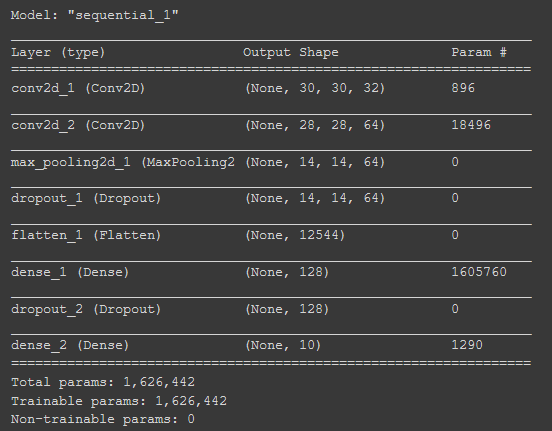
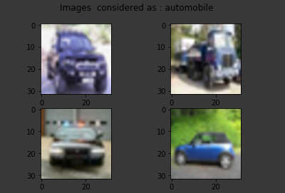
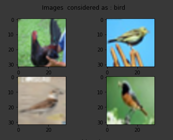
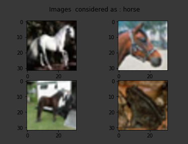
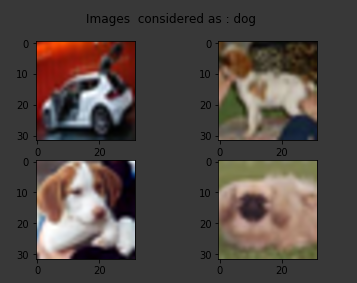

# Classification CIFAR-10 dataset with a CNN model

## Introduction

θα αφοσιωθούμε στη μελέτη, στη σχεδίαση και στη δημιουργία ενός CNN μοντέλου το οποίο θα πρέπει να αναγνωρίζει 10 διαφορετικές κατηγορίες από ένα σύνολο 10000 φωτογραφιών.
Τα δεδομένα για την εκπαίδευση του μοντέλου μας θα τα αντλήσουμε από την CIFAR-10 dataset και οι κατηγορίες που θα πρέπει να ξεχωρίζει το μοντέλο μας είναι οι παρακάτω.

## Methods

Τα αρχικά δεδομένα μας έχουν την μορφή (10000 x 3072), όπου ο αριθμός (10000) αναπαριστά τον αριθμό της εικόνας, και ο αριθμός (3072) αναπαριστά την ίδια την εικόνα, δηλαδή μια εικόνα των 32x32 pixels * 3 κανάλια (rgb).

Όμως γνωρίζουμε ότι σε ένα CNN μοντέλο οι εικόνες που δέχεται πρέπει να είναι της παρακάτω μορφής (width x height x num_channel). Άρα θα πρέπει να μεταμορφώσουμε την βάση μας σε αυτήν την μορφή. Η κάθε εικόνα αποτελείτε από 32x32 pixels και 3 κανάλια για το rgb. Αρία έχουμε 32x32x3 = 3072. Για να φέρουμε την βάση στην επιθυμητή μορφή θα πρέπει πρώτα να χρησιμοποιήσουμε την συνάρτηση reshape 3072->(3,32,32) και έπειτα να χρησιμοποιήσουμε την transpose ώστε τα δεδομένα μας να έχουν την επιθυμητή μορφή (3,32,32)->(32,32,3).

Η transpose δέχεται μια λίστα από αριθμούς όπου δηλώνουμε την σειρά που θέλουμε να μπουν οι στήλες του παλιού πίνακα στον καινούργιο πίνακα. Π.χ με τον πίνακα (num_channel, width, height) αν θέλουμε ο τελικός πίνακας να έχει την μορφή (width x height x num_channel) θα πρέπει (να επισημάνουμε εδώ ότι στον πίνακα της μορφής (num_channel, width, height) το num_channel βρίσκεται στην 0 θέση, τα στοιχεία width βρίσκεται στην 1 θέση και τα στοιχεία height βρίσκεται στην 2 θέση) να δώσουμε την λίστα (1, 2, 0)έτσι δηλώνουμε ότι στον νέο πινάκα μας στην πρώτη διάσταση θα είναι τα στοιχειά που βρίσκονται στην θέση 1 δηλαδή (width) του προηγουμένου πίνακα, στην δεύτερη διάσταση θα είναι τα στοιχειά που βρίσκονται στην θέση 2 και στην τρίτη διάσταση θα είναι τα στοιχειά που βρίσκονται στην θέση 0. 
## Model

 

## Results

 

 

## Installation

### Environment 

Στο παρόν project θα τρέξουμε το μοντέλο μας στο [Colab](https://medium.com/deep-learning-turkey/google-colab-free-gpu-tutorial-e113627b9f5d) ώστε να εκμεταλλευτούμε την Tesla K80 που παρέχει η Google.

### Code

[Script](https://colab.research.google.com/drive/1i9EedyJk26UH8HTsEY1bYlzgIcYX7sqI?usp=sharing)
